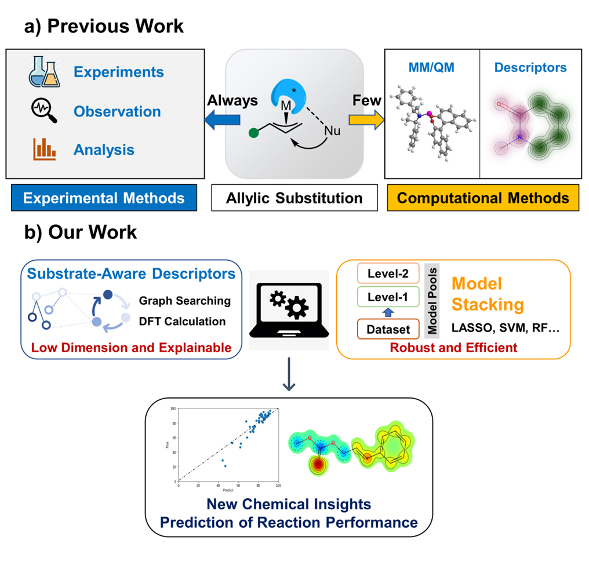

# Substrate-aware-descriptors

This repository contains the data and codes for ''Machine Learning for Reaction Performance Prediction in Allylic Substitution Enhanced by Automatic Extraction of Substrate-Aware Descriptor''.



## Important Environment Dependency

```shell
pip install rdkit
pip install -U scikit-learn
pip install autogluon
pip install xgboost
```

## Dataset

The data used in the paper are in the **data** folder. Some scripts about data cleaning and so on are available in **tools** folder.

## Useful Scripts for Streamlined System

The scripts are in the **utils** folder.

1. The SMILES will be converted into gjf files by Open Babel software.

```shell
python smile2gif.py 'SAMPLE1.csv'
```

2. Gaussian 16.0 and Multiwfn software will used for CDFT calculation.

```shell
python slurm_generate.py 'gjf_path'
python copyChk.py 'gjf_path'
python copyChk_2.py 'gjf_path'
python submit_jobs.py 'script_path'
```

## Quick Start

A running example is given in `demo.ipynb`.